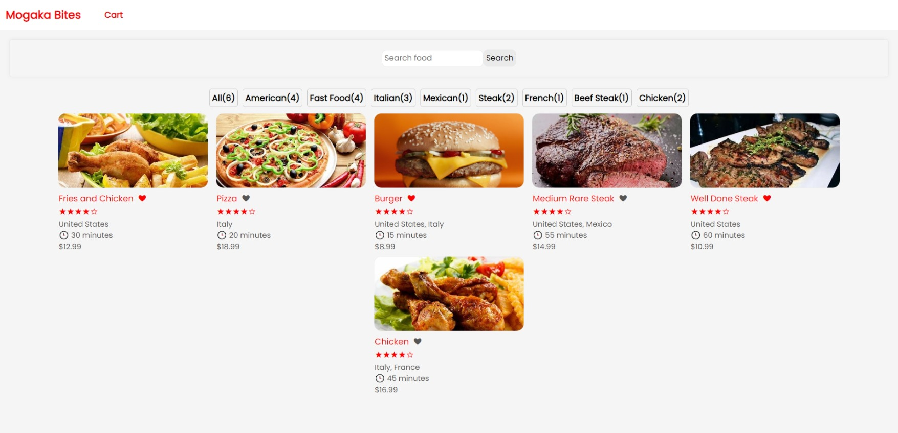

# FoodApp
This project is a front-end implementation of a typical food app. The app contains the home page, food page and cart page. A search functionality is implemented to filter foods. 

## Building and deploying
To deploy the app, use ng build and the include the "build:prod": "ng build --c=production" in your package.json file. You can then deploy it on netlify

